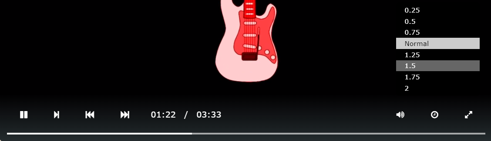

# Lecteur video custom - Web Component

La finalité de ce travail consiste à se familiariser avec les web components en implémentant un lecteur vidéo personnalisé. Les web component permettent de "créer des éléments d'interface utilisateur véritablement encapsulés qui peuvent être regroupés dans une seule balise HTML custom et intégrés facilement sur une page sans craindre de conflits avec les éléments HTML, le style CSS et le JavaScript déjà présents".

Ce travail à été réalisé à l'aide du [cours de M. Buffa](http://miageprojet2.unice.fr/Intranet_de_Michel_Buffa/M2_MIAGE_INTENSE_Technos_Web_2021-2022#Supports_de_cours_.3a)

Autre ressources utilisées:

- [HTML5 Video Events and API](https://www.w3.org/2010/05/video/mediaevents.html)
- [Webaudio-controls](https://g200kg.github.io/webaudio-controls/docs/index.html)

## Fonctionnalités implémentées

### Contrôle

#### Barre de contrôle

| fonction    | Description                                    |
| ----------- | ---------------------------------------------- |
| Play/Pause  | Boutton permettant de jouer ou mettre en pause la vidéo                 |
| Restart     | Boutton permettant de rejouer la video lorsque la vidéo se termine      |
| Next        | Boutton permettant de passer à la vidéo suivante (si on arrive à la fin de la playlist, on reprend en tête de liste) |
| Volume bar  | Bar permettant de gérer le volume de la video                 |
| Mute/UnMute | Button permettant de couper/remettre le son  |
| Plein écran | Button permettant d'afficher la vidéo en plein écran ou bien de revenir à la normal  |
| Progress bar | Bar permettant d'afficher l'état d'avancement de la vidéo et permet de se positionner sur la vidéo  |

