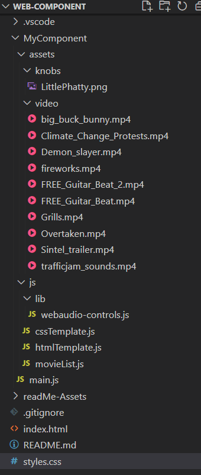
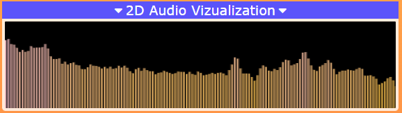

# Lecteur video custom - Web Component

La finalité de ce travail consiste à se familiariser avec les web components en implémentant un lecteur vidéo personnalisé. Les web component permettent de "créer des éléments d'interface utilisateur véritablement encapsulés qui peuvent être regroupés dans une seule balise HTML custom et intégrés facilement sur une page sans craindre de conflits avec les éléments HTML, le style CSS et le JavaScript déjà présents".

Ce travail à été réalisé à l'aide du [cours de M. Buffa](http://miageprojet2.unice.fr/Intranet_de_Michel_Buffa/M2_MIAGE_INTENSE_Technos_Web_2021-2022#Supports_de_cours_.3a)

Autre ressources utilisées:

- [HTML5 Video Events and API](https://www.w3.org/2010/05/video/mediaevents.html)
- [Webaudio-controls](https://g200kg.github.io/webaudio-controls/docs/index.html)

## Arborescence
- MyComponent → le dossier racine dans lequel se situe les principaux fichier js/html/css
- Assets → dossier permettant de stocker les médias nécessaires au fonctionnement (images, vidéos)
- Js → contient le template css et html, le fichier permettant de gérer la liste de vidéo (Pour éviter de surcharger le fichier main.js, j'ai décider de séparer la partie html et css dans des fichier js différent, pour une meilleur visibilité.).

## Fonctionnalités implémentées

### Chargement de la playlist

A cause du fait que je développe en local, sans initier de serveur (ex: express) tout en utilisant l'api webaudio-controls et en tentant des requêtes à un autre serveur pour recevoir les images, j'ai rencontré des problèmes de CORS. 

J'ai donc choisi pour cet exemple d'effectuer le chargement des vidéo de la playsit de manière local avec des fichiers placé en dur sur le répertoire.

### Contrôle

#### Barre de contrôle

| fonction     | Description                                    |
| -----------  | ---------------------------------------------- |
| Play/Pause   | Boutton permettant de jouer ou mettre en pause la vidéo                 |
| Restart      | Boutton permettant de rejouer la video lorsque la vidéo se termine      |
| Next         | Boutton permettant de passer à la vidéo suivante (si on arrive à la fin de la playlist, on reprend en tête de liste) |
| +5s          | Bouton permettant d'avancer la vidéo de 5 secondes |
| -5s          | Bouton permettant de reculer la vidéo de 5 secondes|
| Volume bar   | Bar permettant de gérer le volume de la video                 |
| Mute/UnMute  | Button permettant de couper/remettre le son  |
| Speed        | Button permettant d'afficher un tableau avec différent choix de vitesse selectionnable  |
| Plein écran  | Button permettant d'afficher la vidéo en plein écran ou bien de revenir à la normal  |
| Progress bar | Bar permettant d'afficher l'état d'avancement de la vidéo et permet de se positionner sur la vidéo  |

#### Raccourcie clavier

| Touche clavier    | Description                                 |
| ----------------- | ---------------------------------------------- |
| Barre d'espace    | Play/Pause                |
| 0                 | Reset la vidéo (00:00)      |
| ←                 | -5s |
| →                 | +5s                |
| f                 | Plein écran  |
| m                 | Mute/UnMute  |

### Knobs et visualisation 2d du son

## Interface 

